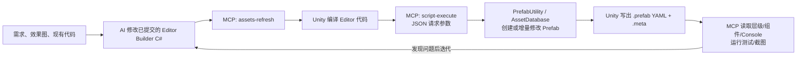

# bsidem：AI 生成与维护 Unity Prefab 的工作流

> 调查日期：2026-08-19
>
> 调查对象：当前 `bsidem` 工作区、Unity 2022.3.62f2、`com.ivanmurzak.unity.mcp@0.88.0`

## 先说结论

这个项目的主方案不是“AI 生成一份 Prefab JSON，再把 JSON 转成 Prefab”。更准确地说，它是下面这条链：

1. AI 阅读需求、现有 Prefab、运行时代码和项目命名规则。
2. AI 编写或修改一份可提交的、幂等的 Unity Editor C# builder。
3. MCP 用 JSON 作为工具调用参数，让正在运行的 Unity Editor 刷新、编译并执行 builder。
4. builder 通过 `PrefabUtility`、`AssetDatabase`、`SerializedObject` 等 Unity Editor API 创建或增量修改 Prefab。
5. Unity 自己把结果序列化成 `.prefab` YAML 和 `.meta`。
6. MCP 再读取层级和组件、检查 Console、跑 EditMode 测试、必要时截图，形成闭环。

一句话概括：

> **Editor C# 是 Prefab 结构的可审查“源代码”，Unity 生成 `.prefab`，MCP 是 AI 操作和验收 Unity 的遥控器，JSON 只是 MCP 的通信格式。**

仓库中没有找到 `prefab-spec.json`、`ui-tree.json` 一类作为 Prefab 真相源的 JSON DSL。

## 总体架构



这套方案的核心其实不依赖 MCP：开发者也可以在 Unity 菜单里手动点 builder，或者用 Unity 的批处理入口执行。MCP 的价值是让 AI 能独立完成“执行—观察—修正—验证”这一整圈，而不只是把 C# 文件写出来后停下。

## 当前项目里的四层实现

| 层 | 当前实现 | 作用 |
|---|---|---|
| AI 到 MCP 的连接 | 仓库根目录 `.mcp.json`、本机 `.codex/config.toml` | 告诉 AI 客户端本地 MCP 服务地址 |
| Unity MCP 服务 | `com.ivanmurzak.unity.mcp@0.88.0` | 在 Unity Editor 内暴露 Prefab、GameObject、Console、测试、截图、动态 C# 等工具 |
| Prefab 的确定性作者 | `UIBuildUtil.cs`、`UIPrefabIO.cs`、各功能 builder | 用 Editor API 表达节点树、布局、组件和序列化引用 |
| 产物与验收 | `.prefab` / `.meta`、EditMode 测试、MCP 读回和截图 | 保存 Unity 可直接使用的资源，并检查结构和行为 |

### 1. MCP 连接层

当前根目录 `.mcp.json` 的结构是：

```json
{
  "mcpServers": {
    "ai-game-developer": {
      "type": "http",
      "url": "http://localhost:<port>/p/<project-id>"
    }
  }
}
```

本机 Codex 也可以使用 TOML：

```toml
[mcp_servers.ai-game-developer]
enabled = true
startup_timeout_sec = 30
tool_timeout_sec = 300
url = "http://localhost:<port>/p/<project-id>"
```

这些是每台开发机自己的连接信息，不是 Prefab 数据。当前项目会忽略根目录和 `UnityProject/` 下的 `.mcp.json`，`UnityProject/UserSettings/AI-Game-Developer-Config.json` 也在忽略范围内。当前两份 `.codex/config.toml` 仍处于未跟踪状态，并没有被同一条规则自动保护；应补进本机忽略或全局忽略，避免误提交。不要把其中的 token、端口或项目 pin 提交到仓库。

### 2. MCP 工具层

Unity 插件会暴露类似这些工具：

- `assets-refresh`：刷新 AssetDatabase，触发脚本导入和编译。
- `script-execute`：在 Unity Editor 中动态编译并执行一小段 C#。
- `assets-prefab-open/save/close/create`：打开、保存、关闭或创建 Prefab。
- `gameobject-find/create/modify`：查询或修改当前场景/Prefab Stage 中的 GameObject。
- `gameobject-component-add/modify/get`：操作组件。
- `console-get-logs`：读取 Unity Console。
- `tests-run`：运行 EditMode/PlayMode 测试。
- `screenshot-*`：做视觉验收。

每个工具的输入都是有 JSON Schema 的 JSON。例如执行一个已经编译好的 builder 时，调用载荷可以是：

```json
{
  "csharpCode": "GameEditor.UIBuilder.ImReportPanelBuilder.Build();",
  "className": "ImReportPanelBuilderInvoker",
  "methodName": "Run",
  "parameters": [],
  "isMethodBody": true
}
```

这里的 JSON 只表达“调用哪个工具、传什么参数”；真正的 UI 层级并不在 JSON 里。

### 3. Editor builder 层

项目中最完整的一套通用实现位于：

- `UnityProject/Assets/GameScripts/Editor/UIBuilder/UIBuildUtil.cs`
- `UnityProject/Assets/GameScripts/Editor/UIBuilder/UIPrefabIO.cs`
- `UnityProject/Assets/GameScripts/Editor/UIBuilder/FriendPrivateChatPanelBuilder.cs`
- `UnityProject/Assets/GameScripts/Editor/UIBuilder/ImReportPanelBuilder.cs`

另一个同思路、但没有复用 UIBuilder 小框架的例子是：

- `UnityProject/Assets/GameScripts/Editor/MainCity/MainCityHudAssetSetup.cs`

它们最终都走 Unity 官方 Editor API，不手写 `.prefab` YAML。两种 builder 的所有权策略略有不同：UIBuilder 尽量保留美术后填的表现值；`MainCityHudAssetSetup.Apply()` 则会在每次执行时确定性地重写它负责的布局、Sprite、颜色和引用。复刻时应按 Prefab 归属选择其中一种，不要模糊混用。

### 4. Unity 产物层

builder 执行后，真正落盘的仍然是 Unity 原生资源：

- `.prefab`：Unity YAML 序列化数据。
- `.meta`：GUID 和导入信息。
- 被 Prefab 引用的 Sprite、材质、字体、脚本等资源。

本项目会把 builder 与生成后的 Prefab 一起提交。这样普通开发机即使暂时没有 MCP，也可以直接使用 Prefab；同时，结构变更仍能通过 C# diff 审查和重放。

## Editor builder 是怎样做到可重跑的

### `UIPrefabIO`：负责资产文件生命周期

`UIPrefabIO.EditPrefab(path, build)` 做了两条路径：

- Prefab 不存在：创建临时根 GameObject，调用 `build`，再 `PrefabUtility.SaveAsPrefabAsset`。
- Prefab 已存在：`LoadPrefabContents`，增量调用 `build`，保存，最后在 `finally` 中 `UnloadPrefabContents`。

它还提供：

- `EnsureFolder`：递归确保 Asset 目录存在。
- `EnsureComponent<T>`：组件不存在才添加，避免重复组件。

这层解决“文件怎么创建、加载、保存和卸载”的问题。

### `UIBuildUtil` / `UINode`：负责节点树和组件

`UIBuildUtil.Ensure(parent, name)` 按直接子节点名称查找：

- 找到了就返回原节点，并标记 `Created = false`。
- 没找到就创建带 `RectTransform` 的节点，并标记 `Created = true`。

`UINode` 再提供链式操作：

- `Anchor`、`Stretch`：设置 RectTransform。
- `Need<T>`：缺组件才添加。
- `Text`：创建 TMP 文本及初始样式。
- `Placeholder`：生成灰模 Image。
- `Raycast`、`RaycastPad`：配置交互射线。
- `Vertical`、`Layout`、`Fit`、`MaxWidth`：配置布局组件。

最关键的规则是：

```csharp
private bool Writable => Created || UIBuildUtil.ForceLayout;
```

普通重跑时，锚点、尺寸等只写到本次新建的节点；已经存在的节点尽量保持原样，因此美术后来填写的 Sprite、材质、字体和颜色不会被 builder 随手冲掉。确实需要按新设计重排时，才显式执行 `BuildForceLayout()`。

有一个值得注意的实现细节：当前 `Anchor`、`Stretch`、`Layout` 等方法使用 `Writable`，所以 `ForceLayout` 会重写已有布局；但 `Text` 和 `Placeholder` 目前只检查 `Created`，即使开启 `ForceLayout` 也不会重写已有文字样式或占位颜色。这与强制重排菜单文案里“会重置文字样式”的描述并不完全一致。复制这套设计时应先确定自己想要的语义，再用测试把它钉住。

这不是严格的“所有字段都永不覆盖”。功能正确性相关的值，例如交互节点的 `raycastTarget`，可能会故意无条件修正。项目里的原则是先明确每个字段由谁拥有：

- 结构和功能契约归 builder。
- 美术表现归美术或已有资源。
- 必须修复的功能性残留可以越过增量保护，但要在代码中写清理由。

### 功能 builder：表达一个具体 Prefab

功能 builder 负责：

- Prefab 路径和设计尺寸常量。
- 节点树和节点命名。
- 锚点、尺寸、初始开关状态。
- Button、TMP、ScrollRect、列表组件等。
- 私有 `[SerializeField]` 的对象引用。
- 列表 item 子 Prefab 的注册。
- 旧结构迁移。
- `[MenuItem]` 入口以及普通/强制重排两种模式。

例如 `FriendPrivateChatPanelBuilder` 会一次生成主面板和五个 item Prefab；`ImReportPanelBuilder` 则生成举报弹窗灰模。项目历史明确规定，聊天页 Prefab 的节点结构由 builder 唯一维护，不手工编辑节点树。

### 私有序列化字段怎样接线

对公开组件字段可以直接赋值；对插件或业务组件的私有 `[SerializeField]`，builder 使用 `SerializedObject`：

```csharp
var serialized = new SerializedObject(component);
serialized.FindProperty("contentPanel").objectReferenceValue = content;
serialized.FindProperty("itemSize").vector2Value = new Vector2(240f, 300f);
serialized.ApplyModifiedPropertiesWithoutUndo();
```

这让对象引用仍由 Unity 正确序列化，不需要猜 YAML 中的 `fileID` 或 GUID。

## 一份可以复用的最小 builder 示例

下面这个示例沿用本项目的工具类。它表达的是“结构代码”，不是运行时代码：

```csharp
using TMPro;
using UnityEditor;
using UnityEngine;
using UnityEngine.UI;

namespace GameEditor.UIBuilder
{
    public static class SamplePanelBuilder
    {
        private const string PanelDir = "Assets/AssetRaw/UI/Sample";
        private const string PanelPath = PanelDir + "/SamplePanel.prefab";

        [MenuItem("Game Framework/UI/构建 SamplePanel 骨架")]
        public static void Build()
        {
            Run(forceLayout: false);
        }

        [MenuItem("Game Framework/UI/构建 SamplePanel 骨架（强制重排布局）")]
        public static void BuildForceLayout()
        {
            Run(forceLayout: true);
        }

        private static void Run(bool forceLayout)
        {
            UIBuildUtil.ForceLayout = forceLayout;
            try
            {
                UIPrefabIO.EnsureFolder(PanelDir);
                UIPrefabIO.EditPrefab(PanelPath, BuildPanel);
                AssetDatabase.SaveAssets();
                AssetDatabase.Refresh();
            }
            finally
            {
                UIBuildUtil.ForceLayout = false;
            }
        }

        private static void BuildPanel(UINode root)
        {
            root.Need<Canvas>();
            root.Need<GraphicRaycaster>();

            var dialog = UIBuildUtil.Ensure(root, "m_rect_dialog")
                .Anchor(
                    new Vector2(0.5f, 0.5f),
                    new Vector2(0.5f, 0.5f),
                    new Vector2(0.5f, 0.5f),
                    Vector2.zero,
                    new Vector2(760f, 420f))
                .Placeholder(0.9f, 1f);

            var title = UIBuildUtil.Ensure(dialog, "m_text_title").Stretch(32f, 300f, 32f, 24f);
            title.Text("Sample title", 42f, TextAlignmentOptions.Center);

            var confirm = UIBuildUtil.Ensure(dialog, "m_btn_confirm")
                .Anchor(
                    new Vector2(0.5f, 0f),
                    new Vector2(0.5f, 0f),
                    new Vector2(0.5f, 0f),
                    new Vector2(0f, 40f),
                    new Vector2(300f, 88f))
                .Placeholder(0.75f, 1f);

            confirm.Need<Button>();
            confirm.Raycast(true);

            UIBuildUtil.Ensure(confirm, "m_text_confirm")
                .Stretch()
                .Text("Confirm", 36f, TextAlignmentOptions.Center);
        }
    }
}
```

如果朋友的项目没有本项目的 `UIBuildUtil` / `UIPrefabIO`，可以照着这个思路写一个更小的内部 DSL。真正重要的不是类名，而是这些性质：按稳定 key 查找、缺什么补什么、清楚区分新建与已有节点、保存路径固定、重复执行结果一致。

## AI 实际怎样触发 builder

### 方式 A：MCP 直接调用工具

支持 MCP 的 AI 客户端会直接调用 `assets-refresh`、`script-execute`、`tests-run` 等工具。用户看到的可能只是工具调用记录，看不到中间 JSON 文件。

### 方式 B：通过 `unity-mcp-cli`

本项目计划文档中也使用 CLI，思路如下：

```bash
unity-mcp-cli run-tool assets-refresh \
  --path <repo>/UnityProject \
  --input '{"options":"ForceSynchronousImport"}'

unity-mcp-cli run-tool script-execute \
  --path <repo>/UnityProject \
  --input-file invoke-builder.json
```

临时的 `invoke-builder.json`：

```json
{
  "csharpCode": "GameEditor.UIBuilder.SamplePanelBuilder.Build();",
  "className": "SamplePanelBuilderInvoker",
  "methodName": "Run",
  "parameters": [],
  "isMethodBody": true
}
```

`script-execute` 这里并不是把整份 builder 临时塞进 MCP。长期代码已经存在于 `Assets/GameScripts/Editor/` 并经过 Unity 正常编译；动态代码只负责调用一个公开静态入口。

### 方式 C：人在 Unity 菜单中执行

因为 builder 带 `[MenuItem]`，没有 MCP 时也可以直接点击，例如：

```text
Game Framework/UI/构建 SamplePanel 骨架
```

这正是这套方案可维护的地方：MCP 消失不会让 Prefab 失去再生方式。

## 为什么项目不推荐 AI 用 MCP 一节点一节点搭复杂 Prefab

插件确实支持下面这种直接路径：

```text
assets-prefab-open
  -> gameobject-create / component-add / component-modify
  -> assets-prefab-save
  -> assets-prefab-close
```

这些工具也可以接收 `pathPatch` 或 JSON Merge Patch，所以从表面看很像“JSON 生成 Prefab”。它适合查看、探针、小型一次性修改或原型，但不是当前项目创作复杂 UI 的主要方式，原因是：

- 60 个以上节点会变成大量有顺序依赖的远程调用。
- 中途失败后很难判断已经执行到哪一步。
- 使用层级 path 或临时 instance ID，结构变化后容易失效。
- 重跑容易重复加节点、组件或覆盖美术后填的值。
- 变更最终只剩几千行 Unity YAML，代码审查很差。
- 打开 Prefab Stage 后如果忘记配对关闭，会把用户的 Editor 留在编辑模式。
- 同样的改动无法稳定地在另一台机器或另一个分支重放。

因此，本项目给 AI 的本机规则是：

> **MCP 用来读和验收；Prefab/Scene 的长期结构改动通过已提交的 Editor C# 完成，再由 MCP 运行。**

这是一条项目约定，不是 Unity MCP 的技术限制。

## 从零搭建相同工作流

### 第 1 步：把 MCP 当开发工具接入

本项目当前使用 Unity 2022.3.62f2 和：

```json
"com.ivanmurzak.unity.mcp": "0.88.0"
```

它通过 OpenUPM 解析；当前项目的 scope 包含：

```json
"com.ivanmurzak.unity.mcp",
"extensions.unity.playerprefsex"
```

在 Unity 中打开对应的 AI Game Developer 窗口，启动本地服务，然后为所用 AI 客户端生成或手工填写 `.mcp.json` / TOML。端口、token、project id 全部按本机配置，放进忽略规则。

### 第 2 步：先定“谁是 Prefab 的唯一作者”

不要让同一个 Prefab 同时由以下几方随意改结构：

- builder；
- 人工拖节点；
- AI 的逐节点 MCP 调用；
- 运行时自修复逻辑。

建议把边界写进仓库规则：

```text
Builder 管节点树、必要组件、关键序列化引用和功能性属性。
美术管 Sprite、材质、字体、颜色与约定允许手调的布局。
Prefab 结构变更只改 builder；生成后的 prefab 与 builder 一起提交。
MCP 负责执行、读取和验收，不作为复杂 Prefab 的唯一操作记录。
```

并非所有 Prefab 都必须 builder 化。本项目也有美术手工维护、没有 builder 的 Prefab。关键是逐个 Prefab 明确归属，而不是混用。

### 第 3 步：建立一层很薄的幂等 API

至少提供：

- `EnsureChild(parent, stableName)`。
- `EnsureComponent<T>(gameObject)`。
- `EditPrefab(path, action)`，内部保证 load/save/unload 成对。
- `Created` 或等价状态，用于保护已有美术值。
- 显式的 `ForceLayout` / migration 入口。

不要一开始设计一套很大的 JSON UI DSL。C# 本身已经有类型系统、Unity API、对象引用和代码审查工具；项目当前的薄封装只有在重复模式出现时才增加方法。

### 第 4 步：每个功能一份公开静态 builder

建议每份 builder 都具备：

- 固定 Asset 路径。
- 普通增量入口 `Build()`。
- 可选的强制重排入口。
- `[MenuItem]`，方便人手执行。
- 公开静态方法，方便 `script-execute` 调用。
- `try/finally` 恢复全局状态并卸载 Prefab contents。
- 清晰的节点命名和迁移代码。

### 第 5 步：让 AI 闭环验证

推荐顺序：

1. `assets-refresh`，等待 Unity 完成编译。
2. `console-get-logs`，先排除编译错误。
3. `script-execute` 调 builder。
4. 读回 Prefab 层级和关键组件值。
5. 跑 Prefab contract EditMode 测试。
6. 需要看表现时再做截图或 Play Mode 冒烟。
7. builder 连跑两次，确认第二次没有实质变化。
8. 审查 Git diff，只提交本次 builder、Prefab、`.meta`、测试和必要资源。

## 建议写的 Prefab contract 测试

不要只测“文件存在”。可以直接通过 `AssetDatabase.LoadAssetAtPath<GameObject>` 验证：

```csharp
[Test]
public void SamplePanel_HasRequiredStructure()
{
    var prefab = AssetDatabase.LoadAssetAtPath<GameObject>(
        "Assets/AssetRaw/UI/Sample/SamplePanel.prefab");

    Assert.NotNull(prefab);
    Assert.NotNull(prefab.transform.Find("m_rect_dialog"));
    Assert.NotNull(prefab.transform.Find("m_rect_dialog/m_btn_confirm")
        ?.GetComponent<Button>());
}
```

实际项目还会检查：

- RectTransform 的 anchor、pivot、sizeDelta。
- Button/Image/TMP/ScrollRect 等组件是否存在。
- Sprite、材质和字体引用是否正确。
- 私有序列化引用是否接到了预期节点。
- 列表 item Prefab 是否注册。
- Raycast 是否开启。
- 模板节点默认 active 状态。

对关键 builder，建议在第一次执行后记录 Prefab hash，再执行一次并比较第二次结果，以证明幂等。

## 当前项目已经踩过的坑

### 1. 不要直接拼 Unity YAML

`fileID`、GUID、序列化版本和对象引用很脆弱。让 Unity API 生成，AI 只写可读的 C# 意图。

### 2. “Ensure 新位置”不等于完成节点迁移

节点从 A 移到 B 时，如果只在 B 下 `Ensure`，A 下的旧节点还在，会出现同名孤儿。项目使用 `MigrateInto` 一类显式迁移，并要求迁移本身也幂等。

### 3. 新增组件时要初始化它的关键字段

如果节点已存在、组件是本次新加，只看 `Created` 会漏掉字段初始化。项目对 `ContentSizeFitter`、最大宽度组件等单独判断 `justAdded || Writable`。

### 4. 灰模 Image 默认可能关闭 Raycast

本项目的 `Placeholder()` 为了不挡下层，默认把 `raycastTarget` 关掉。Button、输入框、长按区域等交互节点必须显式 `Raycast(true)` 或添加透明射线底，否则表现是“点了没反应，而且无报错”。

### 5. 节点名也是代码生成契约

本项目用节点前缀生成 UI 字段，例如：

```text
m_go_ -> GameObject
m_rect_ -> RectTransform
m_text_ -> TMP_Text
m_btn_ -> Button
m_img_ -> Image
m_rimg_ -> RawImage
m_scroll_ -> ScrollRect
m_tmp_input_ -> TMP_InputField
m_loopListView2_ -> LoopListView2
```

朋友的项目如果也有绑定代码生成器，应把命名规则纳入 builder，而不是事后人工改名。

### 6. Unity 编译期间 MCP 会短暂不可用

刷新或写入 Editor 脚本后会触发 domain reload。应等待编译结束，再读 Console；不要把短暂断线当成业务失败不断重试。

### 7. 本机 MCP 配置可能污染 Player 构建

这个项目历史上遇到过 MCP 依赖生成大量 `Assets/Plugins/NuGet/` DLL、插件修改 scripting define、Player 包被开发工具污染的问题。因此建议：

- 把 MCP 当 Editor/dev-only 工具。
- 不提交 token、UserSettings、自动生成的 agent skill 和 NuGet 产物。
- 在 CI/Player 构建前明确检查 MCP runtime、NuGet DLL 和 `UNITY_MCP_READY` 等 define。
- 不要直接照搬当前某台机器的 `ProjectSettings.asset`。

当前工作区的 `ProjectSettings.asset` 正好含有未提交的 `UNITY_MCP_READY` 变化；这是本机工具状态，不是 Prefab 工作流本身需要的设计。

### 8. 注意 Prefab 的纯换行噪音

当前仓库 `core.autocrlf=true` 且没有统一 `.gitattributes`，Unity 保存后可能把 CRLF 改成 LF，导致 `git status` 显示 modified，但没有实质 `numstat`。提交前要看真实 diff，避免把几千行纯 EOL 变化混进功能提交。

## 给另一个项目的推荐落地版本

如果只想复刻最有价值的 20%，建议先做这些：

1. 安装一个 Unity MCP bridge，并把连接配置设为本机私有。
2. 在 `Assets/Editor/PrefabBuilders/` 放 `PrefabIO.cs` 和 `BuildNode.cs` 两个薄工具类。
3. 每个复杂 UI/场景接线写一份 `XxxPrefabBuilder.cs`，有公开静态 `Build()` 和菜单入口。
4. 规定 builder 是所管理 Prefab 的结构唯一作者，美术值有明确保护边界。
5. AI 只通过 MCP 执行 builder、读回、跑测试和截图；复杂结构不靠几十次临时工具调用堆出来。
6. 为关键 Prefab 写 5～20 条结构 contract 测试，并验证 builder 二次执行无变化。
7. builder、Prefab、`.meta` 和测试一起提交；本机 MCP 配置与生成依赖不提交。

如果 Prefab 只有两三个节点，直接 MCP 操作也可以；当层级复杂、需要多人协作、美术会继续填资源、或者必须跨分支复现时，就应该尽早切到 committed Editor builder。

## 本次调查的关键证据

- `UIBuildUtil.cs`：文件注释明确写了“缺的补、有的不动；只在新建节点时写布局；不覆盖已有美术引用”。
- `UIPrefabIO.cs`：实际使用 `LoadPrefabContents` / `SaveAsPrefabAsset` / `UnloadPrefabContents`。
- `FriendPrivateChatPanelBuilder.cs`：带 `[MenuItem]`，一次生成主面板和多个 item，并支持强制重排。
- `ImReportPanelBuilder.cs`：复用同一套基础设施生成另一个完整面板，证明这不是单例脚本。
- `MainCityHudAssetSetup.cs`：另一条功能级幂等 Editor 接线工具，通过 `script-execute` 调用。
- `docs/maincity/plans/2026-07-10-maincity-minimap-joystick.md`：写明 Prefab/Scene 通过 Unity Editor API 幂等生成，不手拼 YAML，并给出 MCP JSON 调用示例。
- `UnityProject/docs/DevDoc/IM/好友私聊-客户端开发计划.md`：明确聊天页 Prefab 结构的唯一作者是 builder，不手改节点树。
- 提交 `e278d3432`：提交说明完整记录了为什么选 committed Editor script，以及结构/样式的所有权边界。
- 本次对非插件、非 Library 的 JSON 做了检索，没有找到 Prefab JSON DSL。

## 最终判断

你最开始的猜测可以修正成：

```text
不是：AI -> Prefab JSON -> Editor 转换 -> Prefab

而是：AI -> 可提交的 Editor C# builder
             -> MCP 用 JSON 发“刷新/执行/读取/测试”命令
             -> Unity Editor API 生成原生 Prefab
             -> MCP 验收并迭代
```

这里最值得复制的不是某个 JSON 格式，而是三个工程原则：

1. **用幂等的 Editor 代码保存生成意图。**
2. **让 Unity 自己负责资源序列化。**
3. **让 MCP 给 AI 提供执行和反馈闭环。**
