# 参考图索引

手工收集的参考图。每张图的说明、状态和关联文档记录在同目录的 `images.yml`。AI 生成的探索图见 [[美术参考/ai生成/README|AI 美术探索索引]]，外部图集链接见 [[图片参考链接]]。

## 风格：排线

### 排线-巴洛克大门与云

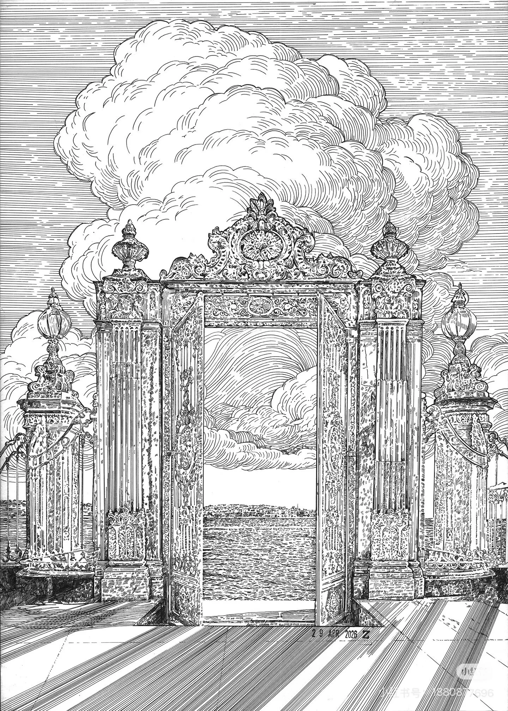

### 排线-山坡古树与草地

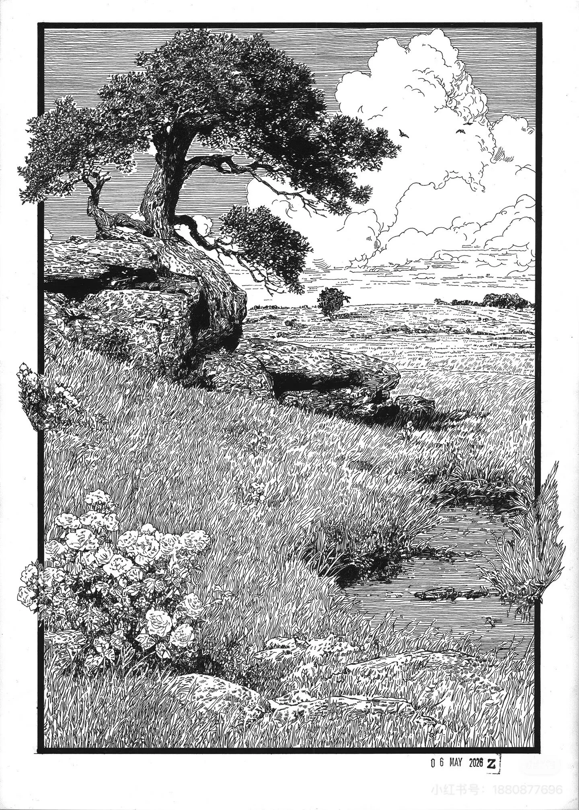

### linework

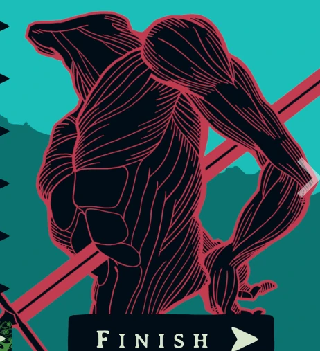

### linework2

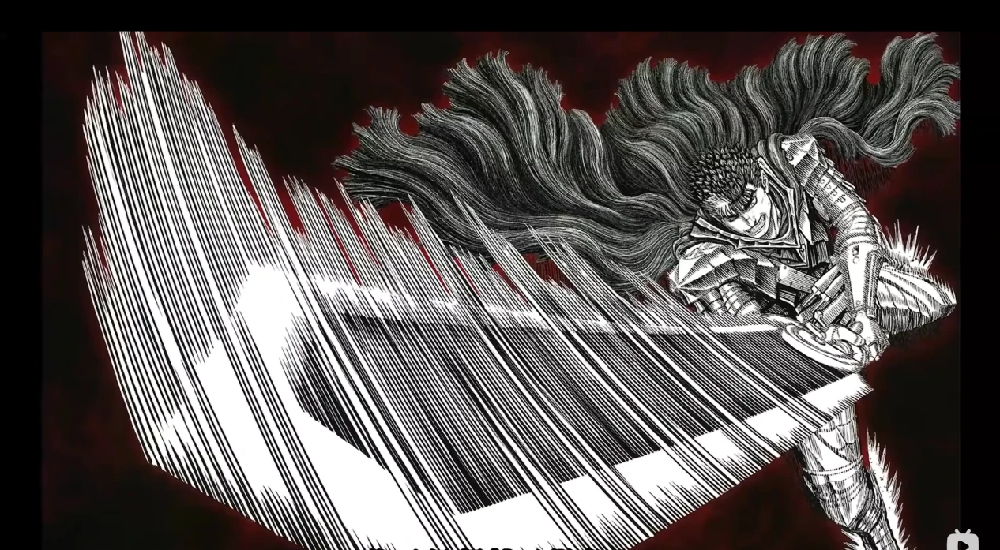

### style

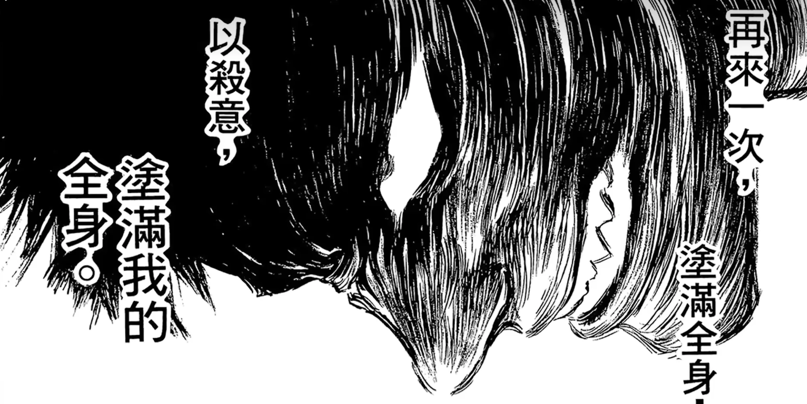

## 风格：漫画分镜

### 漫画-面部特写与重排线

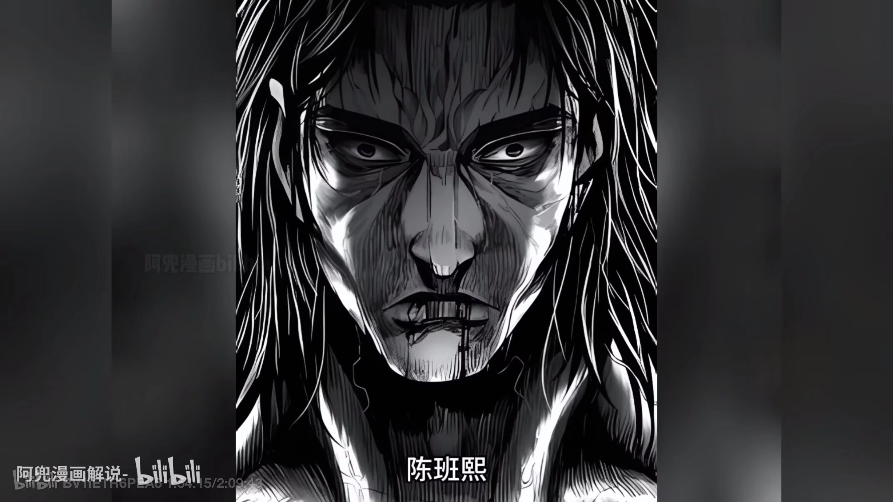

### 漫画-肌肉人物与放射线

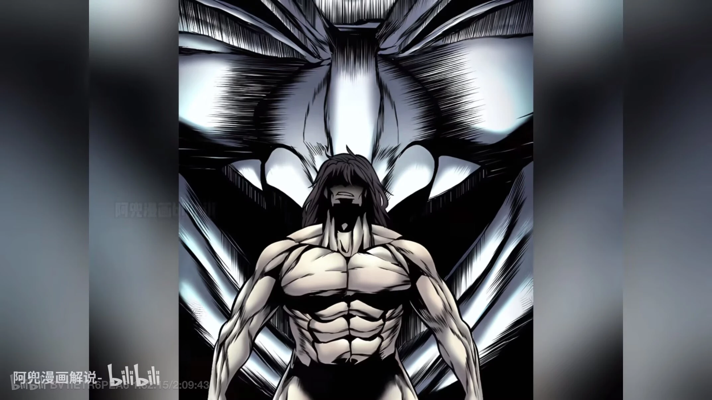

### 漫画-废墟城市远景排线

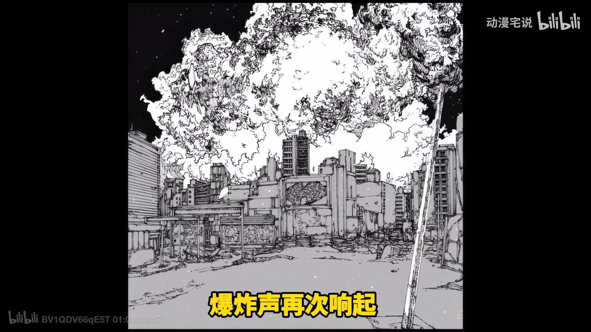

### 漫画-坠入天空的橙紫配色

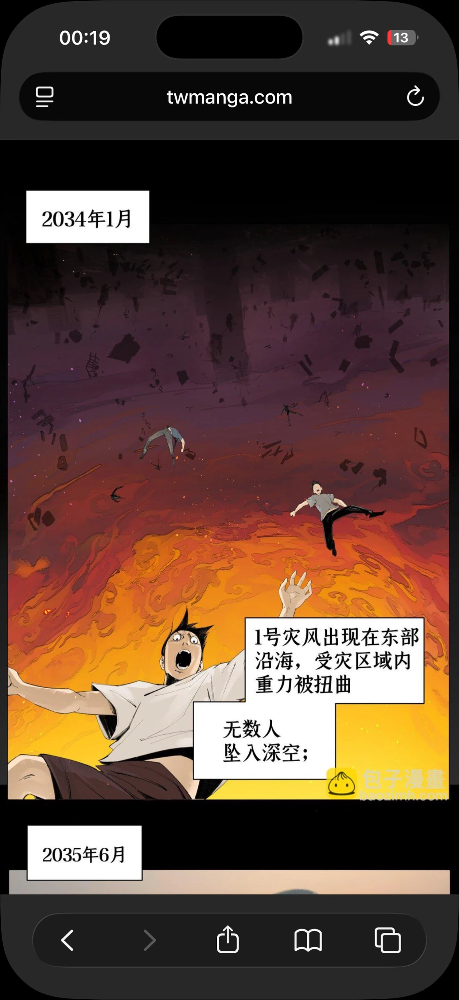

### 漫画-巨口中的人影

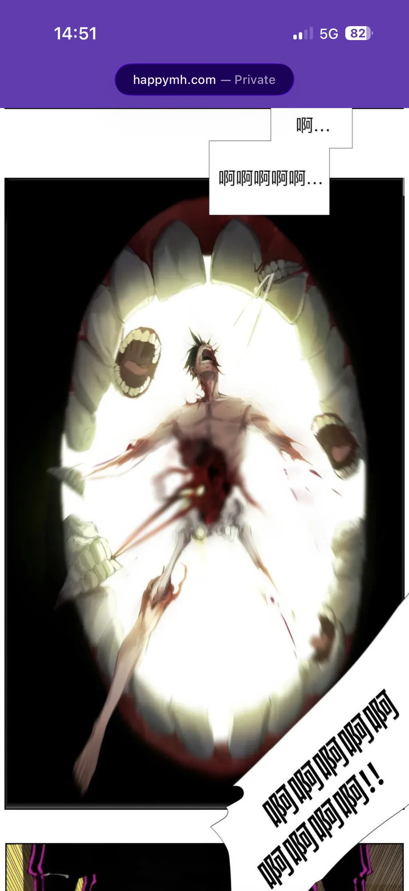

### 漫画-写实灰调分镜

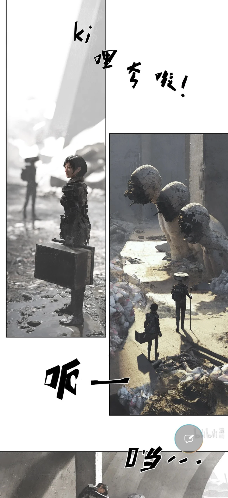

## 风格：淡彩

### 淡彩-漂浮的遗迹碎块

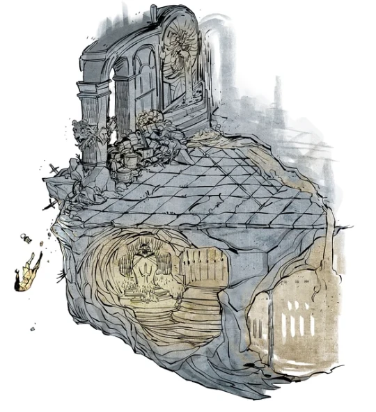

### 淡彩-石像与红披风人物

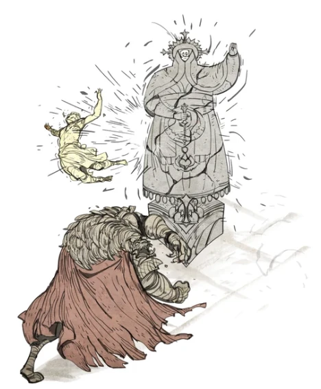

### 淡彩-石巨人与旅人

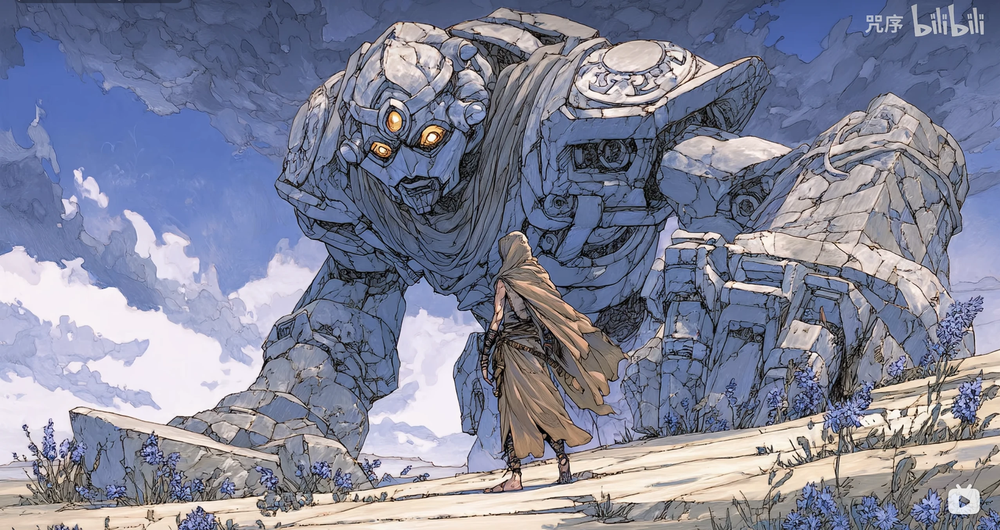

## 纹路

### 密集排线背景与斗篷褶皱

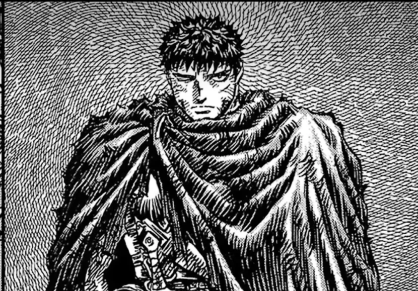

## 怪物

### butcher

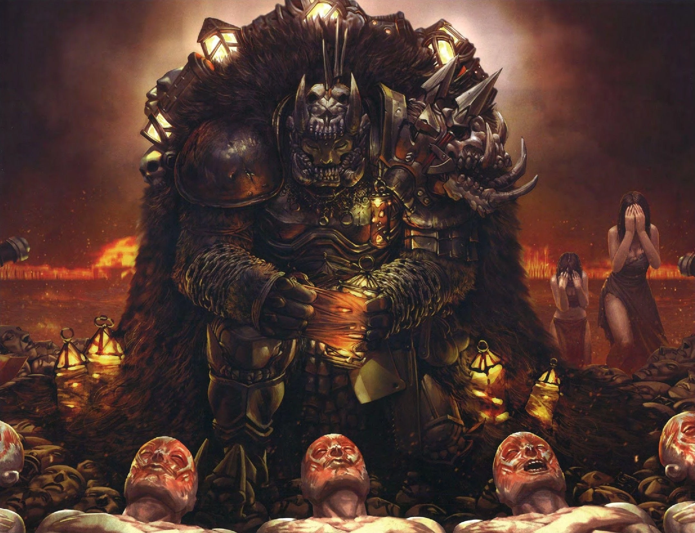

### butcher1

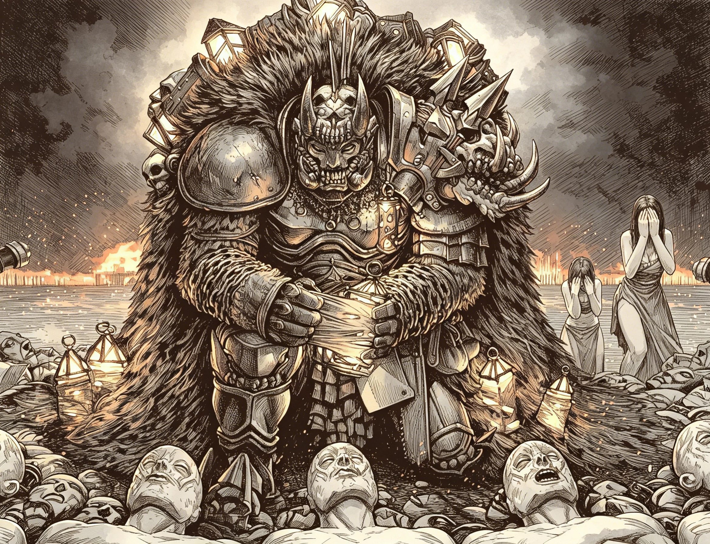
